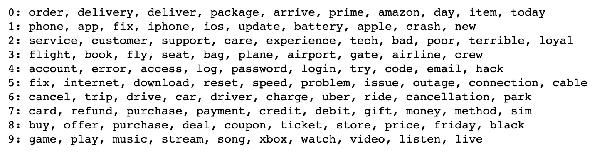
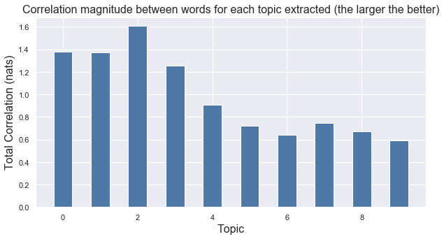

# Natural Language Processing Analysis of Customer Service Twitter Data Using Topic Modeling, Sentiment Analysis, and Clustering Algorithms
I used a **natural language processing (NLP)** approach to understand the topics underlying customer tweets within a Twitter Customer Service dataset. I first focused on **topic modeling/dimensionality reduction** techniques to extract the top recurrent topics and issues mentioned in the collected tweets, which I supplemented by overlaying a **sentiment analysis** to understand whether the conversation around each of these topics was positive (or neutral) or negative. Finally, I related the tweets back to the relevant companies and ran a **clustering algorithm** to group companies that were being talked about in similar ways - taking both topic and sentiment into account.

## Project Intro/Objective
Understanding how customers/users engage with brands online, especially in public channels of communication, can be crucial to managing a company's image. A big aspect of running a business efficiently lies in both understanding and addressing its main pain points as well as highlighting its strengths, and what better way to go about it than by listening directly to what the clients / users have to say? In light of this, I wanted to query customer tweets themselves and extracting the main topics brought up by the public and the associated sentiment. Additionally, this analysis allows business to establish which companies have similar businesses and strengths, which can serve as a novel proxy identifier of potential direct competitors.

## Datasets Used
* Customer Support on Twitter dataset from [Kaggle](https://www.kaggle.com/thoughtvector/customer-support-on-twitter)

## Methods Used
* Exploratory Data Analysis (EDA)
* Natural Language Processing (NLP)
* Topic Modeling 
* Sentiment Analysis 
* Clustering Algorithms / Dimensionality Reduction
* Data Visualization

## Notable Technologies Used
* Python 3, Jupyter Notebook
* Nltk, SpaCy, Scikit-learn **> NLP Text Processing**
* CountVectorizer, TfidfVectorizer, CorEx **> Topic Modeling / Dimensionality Reduction**
* vaderSentiment **> Sentiment Analysis**
* DBSCAN **> Clustering Algorithms**
* Pandas, Numpy, Matplotlib, Seaborn, Tableau **> Data Processing/Visualization tools**
* etc. 

## Main Analysis Threads
* **Tweet Cleaning** - Tweet cleaning by removing hastags, retweets, @s, links, special characters, selecting 500,000 customer tweets to analyze
* **Tweet Lemmatization, Tokenization, and Vectorization** - Application of lemmatization using SpaCy (and custom-built lemma schemes), tokenization through removal of punctuation, lowercasing, and custom stopwords, and term frequency-inverse document frequency count vectorization using ScikitLearn's TfidfVectorizer submodule
* **Topic Modeling / Dimensionality Reduction** - Ran topic modeling using CorEx (semi-supervised algorithm) to create a sparse matrix mapping each tweet's loading on the 10 extracted topics
* **Sentiment Analysis** - Used vaderSentiment to extract overall sentiment for each tweet. Topic loading vectors for each tweet were then multiplied by sentiment score extracted.
* **Clustering Analysis** - Grouping companies by tweet topic and seniment similarity

## Model 
### Topic Modeling
Out of multiple topic modeling techniques attempted (Latent Dirichlet Allocation, Non-null Matrix Factorization), a semi-supervised method (**CorEx**) yielded best results. Unlike LDA and NMF, CorEx establishes topics in a bottom-up fashion by examining the strength of correlations between words in the source documents. An initial exploratory approach yielded 10 cohesive topics to be extracted. Their top recurrent terms were then anchored in a subsequent run of the model for more stable results.
Below is an image of the 10 topics extracted and most dominant words in each as identified by the CorEx model. 

Here are the correlation strengths between the words included in each of the extracted topics.

### Sentiment Analysis
For sentiment analysis, I chose to use vaderSentiment, a module created specifically for analyzing text from social media. Unlike other sentiment analysis packages, vader is designed to be useable with short snippets of text and can gracefully handle both slang and emojis. Below is an example of tweets and their sentiment ratings (simplified to positive/neutral or negative). 

The sentiment analysis was then added to the topic modeling by multiplying the topic vectors for each tweet by +1 for sentiments identified as positive or neutral and -1 for sentiments identified as negative.

### Clustering Analysis
Matching each user tweet to the company it was originally directed at, I ran a clustering algorithm to group companies with similar topic loadings and sentiment, thereby establishing which companies are talked about in similar ways. I chose a DBSCAN model which allowed me to utilize a cosine distance analysis of my sentiment-moderated topic vectors as the basis for my clustering. Exploratory parameter tuning resulted in the identification of 4 clusters, which can be explored in depth through the custom-built Tableau dashboard linked below:
[Tableau Dashboard Link](https://public.tableau.com/profile/valentina.pena#!/vizhome/TopicAnalysisofCustomerServiceTwitter/Dashboard1)

## Take-Homes
This project allowed me to identify the top issues and topics discussed by customers on customer service twitter channels as exemplified by the dataset at hand. Among these were discussions about phones and other electronic gadgets, online shopping and product delivery, as well as air travel and flight delays. In terms of company clustering by topic, the 4 main groups identified centered around companies whose customers were dissatisfied with the service or product, customers whose tweets praised the services, complaints about bad customer experiences, and "other". These insights can be used by companies to identify their strengths and weaknesses as seen through the eyes of their users/customers, as well as to gauge other companies in a similar position (i.e. peers with similar strengths and weaknesses). The latter could be useful as case-studies.

## Final Notes
The code here is still a work in progress - functions and code structure will be updated periodically as I work through fixes!
